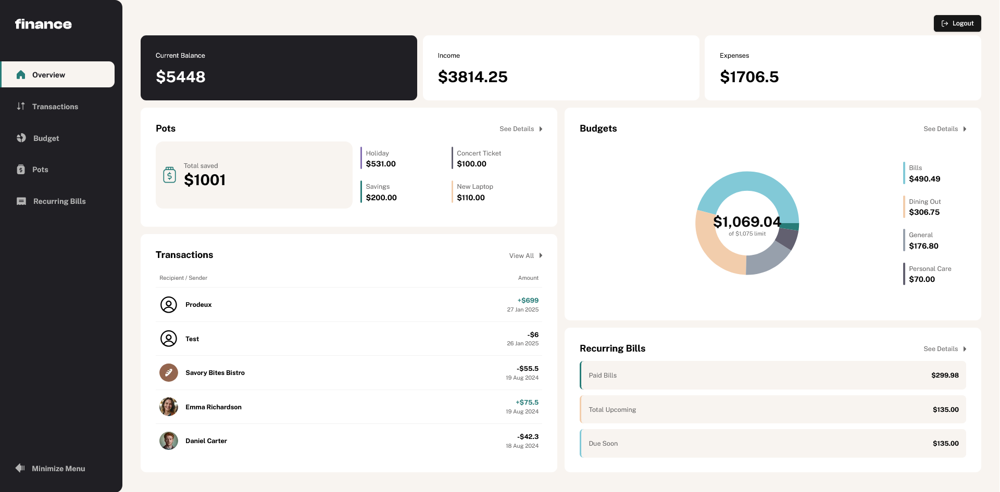

# Frontend Mentor - Personal finance app solution

This is a solution to the [Personal finance app challenge on Frontend Mentor](https://www.frontendmentor.io/challenges/personal-finance-app-JfjtZgyMt1). Frontend Mentor challenges help you improve your coding skills by building realistic projects.

## Table of contents

- [Overview](#overview)
  - [The challenge](#the-challenge)
  - [Screenshot](#screenshot)
  - [Links](#links)
- [My process](#my-process)
  - [Built with](#built-with)
  - [What I learned](#what-i-learned)
  - [Continued development](#continued-development)
  - [Useful resources](#useful-resources)
- [Author](#author)

## Overview

### The challenge

Users should be able to:

- See all of the personal finance app data at-a-glance on the overview page
- View all transactions on the transactions page with pagination for every ten transactions
- Search, sort, and filter transactions
- Create, read, update, delete (CRUD) budgets and saving pots
- View the latest three transactions for each budget category created
- View progress towards each pot
- Add money to and withdraw money from pots
- View recurring bills and the status of each for the current month
- Search and sort recurring bills
- Receive validation messages if required form fields aren't completed
- Navigate the whole app and perform all actions using only their keyboard
- View the optimal layout for the interface depending on their device's screen size
- See hover and focus states for all interactive elements on the page
- **Bonus**: Save details to a database (build the project as a full-stack app)
- **Bonus**: Create an account and log in (add user authentication to the full-stack app)

### Screenshot

### Links

- Solution URL: [https://github.com/Lorand98/personal-finance-app](https://github.com/Lorand98/personal-finance-app)
- Live Site URL: [https://personal-finance-app-azure.vercel.app](https://personal-finance-app-azure.vercel.app)

**Test Credentials:**

- Email: `user@example.com`
- Password: `user1234`

## My process

### Built with

- [React](https://reactjs.org/) - JS library
- [Next.js](https://nextjs.org/) - React framework
- [TawilwindCSS](https://tailwindcss.com/) - A utility-first CSS framework
- [ShadCN UI](https://ui.shadcn.com/) - Accessible and customizable components that you can copy and paste into your apps.
- [Tanstack Table](https://tanstack.com/table/) - Headless UI table component
- [Supabase](https://supabase.io/) - Database and authentication service
- [Vercel](https://vercel.com/) - Deployment and hosting service

### What I learned

Throughout this project, I gained valuable experience in several key areas:

#### Next.js App Router and React Server Components

- Implemented the new app router in Next.js for simplified routing
- Explored React Server Components and server actions
- Built more efficient and scalable application architecture

#### Supabase Integration

- Set up and configured Supabase for database management
- Implemented user authentication flows
- Integrated seamless data storage solutions

#### ShadCN UI Components

- Built accessible and customizable user interfaces
- Modified components to match specific application requirements
- Improved overall user experience through consistent design patterns

#### TailwindCSS

- Mastered utility-first CSS framework principles
- Created responsive designs using utility classes
- Implemented efficient styling solutions for components

#### Full-Stack Development

- Developed end-to-end application features
- Connected front-end interfaces with back-end services
- Deployed and managed a complete web application

This project has significantly enhanced my skills in modern web development, combining multiple cutting-edge technologies into a cohesive solution.

### Continued development

I would like to continue working on this project and improve the following aspects:

- Add more features to the app:

  - Enhance user account management:
    - Implement password recovery functionality
    - Create comprehensive user profile management (account deletion, preferences)
    - Add multi-currency and language support (i18n)
    - Develop smart autocomplete for transaction forms with frequent contacts

- Make the code more efficient:

  - Refactor the code to make it more readable and maintainable (DRY) - e.g.: don't repeat the same code thorughout loading pages, form components, etc.
  - Better and more generalized error handling in actions
  - Improve the performance of the app by optimizing the code and add smoother experience by using more streaming

- Improve the UI/UX:
  - Lazy load images
  - Better loading pages, check the possibility of using Suspense

### Useful resources

- [Supabase + NextJS Auth](https://supabase.com/docs/guides/auth/server-side/nextjs) - This helped me setting up the authentication flow in the app.
- [ShadCN UI](https://ui.shadcn.com/) - This is an amazing library of accessible and customizable components that you can copy and paste into your apps. It also contains a lot of useful resources and documentation.
- [Udemy: The Ultimate React course 2024 from Jonas Schmedtmann](https://www.udemy.com/course/the-ultimate-react-course) - This course helped me understand the new NextJS App Router and also Server Components.

## Author

- Frontend Mentor - [@Lorand98](https://www.frontendmentor.io/profile/Lorand98)
- Linkedin - [@kalmarlorand](https://www.linkedin.com/in/lorand-kalmar-69988b173/)
